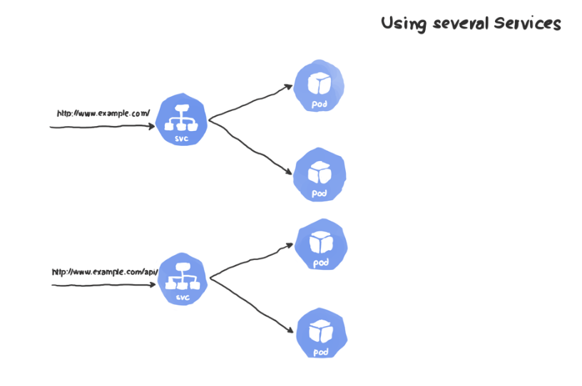

# deploying stuff on k8s

## STEP 1: deploying the `cats-api`

Ideally, this could be just a docker container as we do with `docker-compose` but k8s is all about orchestration and in k8s world, it's a `pod` that holds one or more containers.

So, we can just deploy a pod, right?

No, since pods are _ephemeral_ by nature, we need to create a higher controller(DeploymentController inside `kube-controller-manager`) that takes care of our pod (restart if it crashes, move it around nodes, etc.). For that reason, we’ll use a Deployment. Plus, by assigning `replicas: 2`, there are more than one pods which helps in high scalability.

Let's create our `deployment` resource [cats-api-deployment.yaml](cats-api-deployment.yaml)

## STEP 2: finding `cats-api` in the cluster

So far, the pods, which should be created in STEP 1 are accessible internally inside the cluster network.
To make it accessible from outside, we need to create a _Service_ and an _Ingress_. So, let’s do just that.

> For recap, see [this](https://gist.github.com/boseabhishek/e509ee06b8f92f529be8524e078e33d0#concepts)

### Why are we using a combination of Ingress Controller and Services?

We can create a `type: LoadBalancer`. A LoadBalancer service will create a load balancer that is publicly exposed and has an external IP address. Any traffic arriving at this IP will be routed to one of the backend pods. However, the load balancer is tied to only one service. If we need more than one service for our application (which is a typical use case), we’ll need to create more load balancers and more IP addresses, which is impractical and cannot scale.

The Ingress controller, on the other hand, allows you to tie it to more than one service and choose which requests go to which service depending on the condition you specify (in our case, it’ll be the URL path).


**VS**



### STEP 2A: creating service for `cats-api`

Let's create our `service` resource [cats-api-service.yaml](cats-api-service.yaml)

**N.B.** our Service is the ClusterIP type (default) and we don’t need our service to be accessible externally, this is the job of the Ingress controller.

### STEP 2B: installing Nginx Ingress Controller

Ingress, unlike other Kubernetes objects, does not have a controller that ships with Kubernetes. This means that we need to install our controller of choice to handle our Ingress resource. There are several sources where you can obtain an Ingress controller, each has its own set of features. For this article, we chose the Nginx one. The documentation provides options for installing the controller on several platforms. In our case, we are using Docker Desktop on macOS so the steps are as follows:

```shell

$ kubectl apply -f https://raw.githubusercontent.com/kubernetes/ingress-nginx/nginx-0.30.0/deploy/static/mandatory.yaml
$ kubectl apply -f https://raw.githubusercontent.com/kubernetes/ingress-nginx/nginx-0.30.0/deploy/static/provider/cloud-generic.yaml

```

### STEP 2C: creating ingress for `cats-api-svc`

Let's create our `ingress` resource

